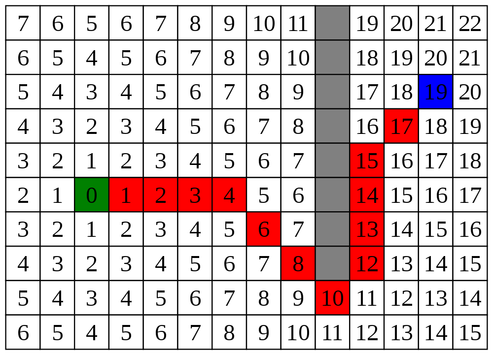

# astar-py
**school project**

*Image from [Wikimedia Commons](https://commons.wikimedia.org/wiki/File:Pathfinding_A_Star.svg)*

A* is an informed search algorithm, or a best-first search.

## Application
### Prerequisites 
- Python 3
  - optinal: virtualvenv
  - pip install flask
  - pip install flask-cors
- React

### Application 

##### Installation & Execution
###### API
Export the environment variable `FLASK_APP=api.py` inside the **py-apy** folder and run `flask run`.

###### Frontend
Change directory to **fe** and run `yarn install`. Then use `yarn run start`

##### Information
green block = start

red block = end

blue blocks = walls

## How it works
Starting from a specific starting node of a graph, it looks to find the path to the given end node position with the least distance travelled. It does this by maintaining a tree of paths originating at the start node and extending those paths one edge at a time until its termination criterion is satisfied.
At each iteration of its main loop, A* needs to determine which of its paths to extend. It does so based on the cost of the path and an estimate of the cost required to extend the path all the way to the goal.

$f(n) = g(n) + h(n)$

## Complexity
Depends on the heuristic $\(h(n)). |h(x) - h*(x)| = O(log h*(x))$ where $h*$ is the optimal heuristic. The logaritm of $h$ error will not grow faster than $h*$. 

The space required for A* is roughly the same as other graph searching algorithms. But, it keeps all nodes inside the memory, which is its drawback..

## Usecase
It's often used for common path finding problems and can be found in video games and similar applications.  
